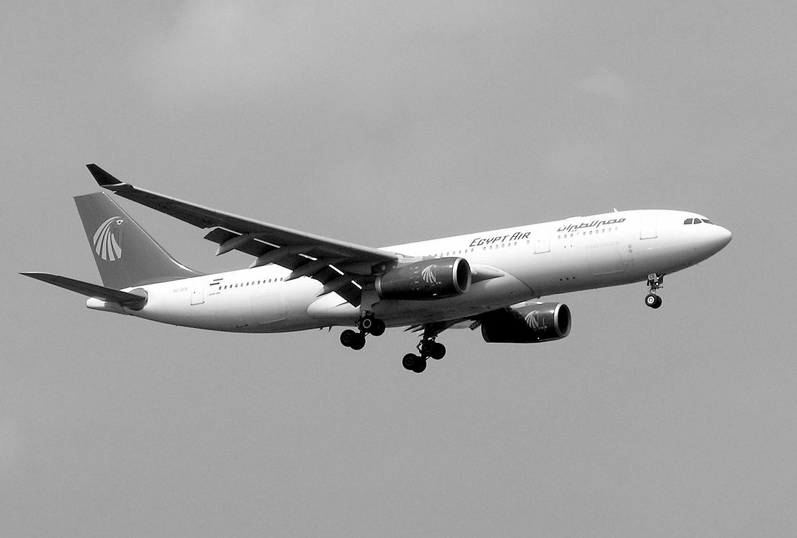
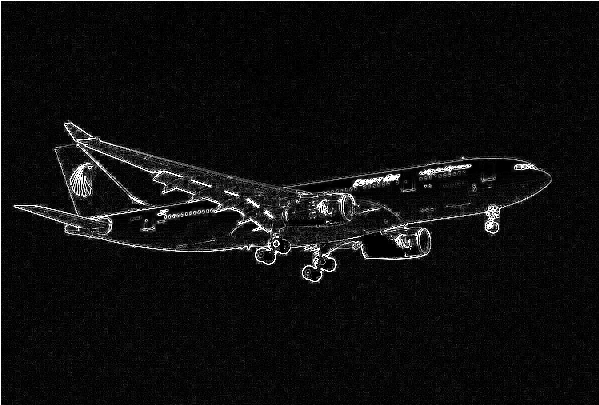
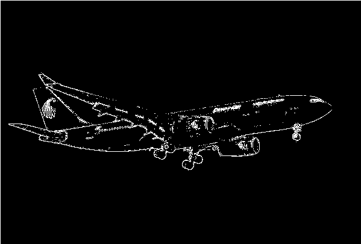
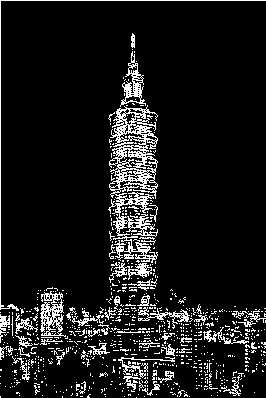

# Prequires

- Python >= 3.10
- Numpy
- Opencv >= 4.8

# Give two images (taipei101.png and aeroplane.png) for testing:  

## 1.Read RGB images and write a function to convert the images to grayscale images. 

Ans:  
Because of each pixels have 3 channels in a RGB image, one for red, one for green, one for blue. If we want to convert this image to gray scale image just given a weight for each channels. Consider to human eyes for luminance, blue is the lowest, red is the highest, and the green channel is the mid of the 3 channels, so we can give the blue channel weight as 0.11, the red channel weight as 0.3, and the green channel weight as 0.6.

## 2.Write a convolution operation with edge detection kernel using zero padding and stride 1

Ans:  
The purpose of convolution is to extract features from images, so convolution also can be considered as a filter.  
The first challenge we encounter is that the output image is smaller than the original image after the convolution operation. This occurs because each pixel undergoes compression through our kernel operator. One solution to this problem is padding the original image with zeros. These padded zeros do not affect the final result and enable us to maintain the new image's size to match that of the original image. 
The initial step in performing convolution on images is to reverse the kernel, moving from top to bottom, left to right, and right to left. The second step involves zero-padding the image, as previously mentioned, to ensure the output image retains the same dimensions as the input image. Since the kernel size is 3x3, there are 9 values within the kernel. The third step entails multiplying these 9 kernel values with the corresponding 9 pixels in the image. The result of this multiplication becomes the new value for the corresponding pixel in the new image. This process is repeated until all pixels have been computed. 
The formula for calculating the new image's dimensions can be expressed as follows: 
$$ floor(\frac{img\_size - kernel\_size + 2*padding}{stride})+1 $$
 

## 3. Write a pooling operation with using Max pooling, 2x2 kernel, and  stride 2

Ans:  
The purpose of max pooling is that make the images smaller than the original one such that can reduce the computations which means it can save more time and resource. In order to achieve this purpose, we can scan each pixels with strides 2. The new image shape can be computed as the convolution equation, but here we have to set out kernel size as 2 and strides 2. 

## 4. Write a binarization operation (set the threshold by yourself, e.g. 128). (>=128) set 255, (<128) set 0 

Ans:  
We can scan each pixels from up to down, left to right, if a pixel value larger than or equal to the threshold which is defined by myself and the value is 130 than we set this pixel as 255 otherwise 0. 

